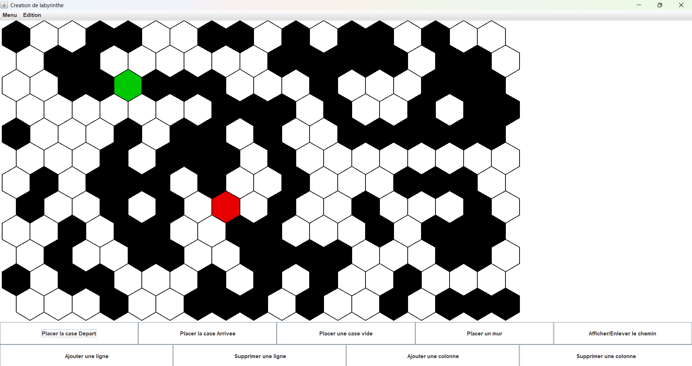

# Java maze application

This application is part a a school project at Telecom Paris

### What is the applcation doing ?

This application allows the user to create and edit a maze with hexagonal tiles.

*Global view of the application*

### Structure of the application
The application contains 3 main parts.
##### The menu bar
It contains 2 Menu
- "Menu", to open and save mazes, or to quit the application
- "Edit", with some big edit operation you can apply to the current maze
##### The main panel
This panel contains the current maze. You can click on the tiles to edit them. The edition choice is managed by the button panel at the bottom.
##### The buttons panel
This panel contains buttons to choose how the user edit the maze : 
- 4 buttons to decide whether the user place a wall, blank tile, start or end of maze
- A button to toggle the shortest path visibility
- 4 buttons to add/remove a row/column to the current maze

### Run the application
There are several ways to run the application.
##### Using Eclipse
You can clone and open the project into Eclipse and launch Main as an entry point.
##### Using Make
The Makefile is present in the folder maze and has two main commands :
- make : to build the project
- make run : to build (if not done already) and launch the application

